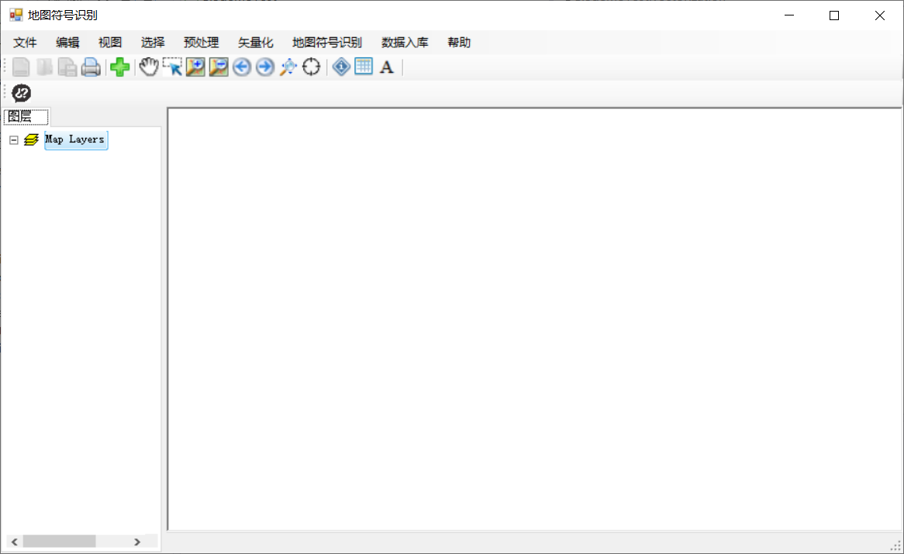
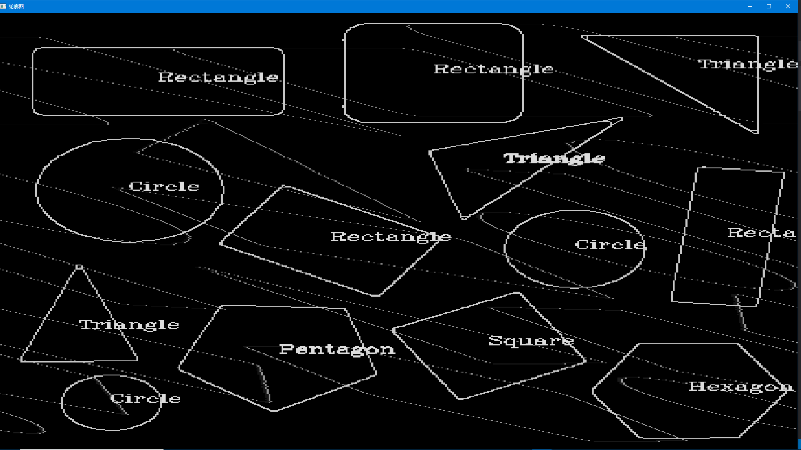

# Map symbol identification system

### Introduction
A system equipped with basic GIS functions like ArcGIS and added a map symbol identification function which users can upload or screenshot an image to the system and it can automatically output the map symbol’ s standard name. 

My job is to design the system’ s basic framework and GIS functions using C# and its third-party libraries DotSpatial. I also do the image processing part and file format conversion part, using GDAL and OpenCV to do reduce the images’ noise, exact its shape and complete the vector-raster conversion function. I used Douglas-Peuker algorithm to simplify the symbol’ s shape based on the number of the detected vertices, which largely reduced the identification process.

### demo
 **UI**

 

